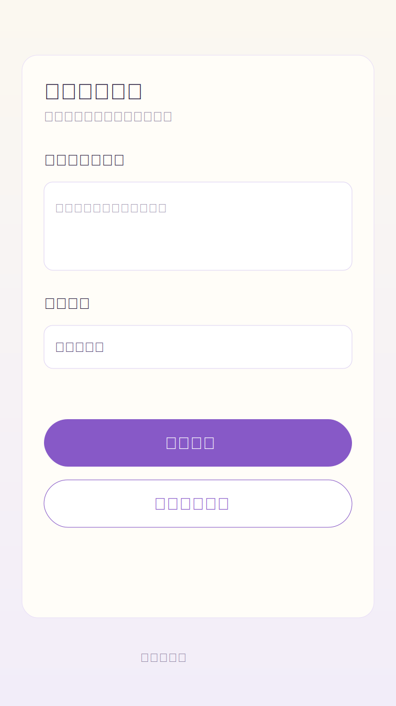
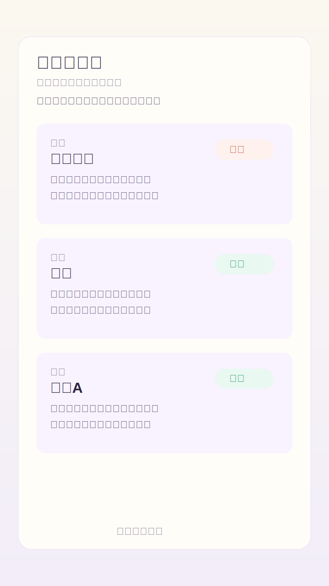
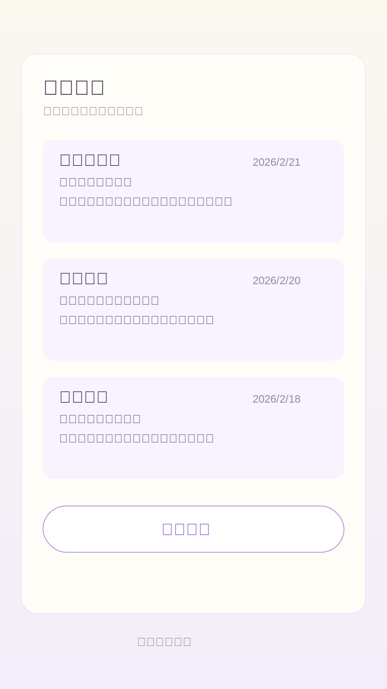

# 塔罗随身占卜（WeChat Mini Program）

一个可以随时随地进行塔罗占卜的微信小程序。


## 最新更新（2026-02-24）

- 已按最新 Stitch 方案重构主视觉（深紫 + 金线）
- 首页、结果页、历史页、牌库页、个人中心完成统一样式升级
- 交互层级优化：核心信息更聚焦、按钮体系更一致、卡片可读性更好

## 项目亮点

- 支持 4 种常用牌阵：单张指引、三张时间流、三张决策盘、关系洞察
- 支持正位 / 逆位，占卜结果更细化
- 启动页塔罗翻牌动画 + 深紫金线神秘主题
- 三牌阵结果页（中文文案）：过去/现在/未来逐张解读 + 综合建议
- 牌库百科（方案 A）：搜索、分类筛选、收藏、排序
- 个人中心（方案 A）：连续打卡、每日提醒、设置入口
- 本地历史记录（最多 50 条），随时回看与复盘
- 纯前端逻辑，开箱即跑，适合二次开发

## 功能演示（视觉示意图，非运行截图）

> 这里展示的是设计示意图（`docs/screenshots/`），用于说明页面结构，不是微信开发者工具里的真实运行截图。

| 首页（提问 + 选牌阵） | 结果页（解读 + 建议） | 历史页（回看 + 管理） |
| --- | --- | --- |
|  |  |  |

## 获取真实运行截图（建议）

1. 在微信开发者工具打开项目并编译
2. 进入首页 / 结果页 / 历史页
3. 用开发者工具截图或手机预览截图
4. 把图片放到 `docs/real-screenshots/` 并替换 README 中的图片链接

## 功能演示（30 秒流程）

1. 打开首页，输入问题（例如：`我该不该换工作？`）
2. 选择牌阵（推荐先用 `三张决策盘`）
3. 点击「开始占卜」
4. 查看每张牌的位置、正逆位、关键词和行动建议
5. 在历史页复盘最近占卜记录

## 技术结构

```text
wechat-tarot-miniapp/
├── app.js
├── app.json
├── app.wxss
├── pages/
│   ├── index/       # 问题输入与抽牌入口
│   ├── result/      # 三牌阵结果展示（中文）
│   ├── history/     # 占卜历史记录
│   ├── dictionary/  # 牌库百科（搜索/筛选/收藏）
│   └── profile/     # 个人中心（提醒/设置）
├── utils/
│   └── tarot.js    # 牌库、牌阵、解读逻辑
└── docs/screenshots/
    ├── index-page.svg
    ├── result-page.svg
    └── history-page.svg
```

## 快速开始

1. 打开微信开发者工具
2. 选择「导入项目」并指向本项目目录 `wechat-tarot-miniapp`
3. 填入你自己的小程序 `AppID`（测试可用测试号）
4. 点击编译运行

## 当前实现说明

- 牌库：包含大阿卡纳 + 小阿卡纳，可在牌库百科中检索
- 抽牌：随机不重复抽取，支持逆位概率
- 结果：三牌阵中文结果页，含逐张解读与综合建议
- 存储：使用 `wx.setStorageSync` 本地保存历史、收藏与提醒设置
- 限制：当前无云端同步、无真实账号体系、无牌面插画资源

## Roadmap

- [ ] 增加牌面插画资源与翻牌动画
- [ ] 增加凯尔特十字等高级牌阵
- [ ] 接入云开发做跨设备历史同步
- [ ] 支持结果分享海报与一键转发
- [ ] 可选接入 AI 深度解牌（云函数）

## 免责声明

本项目用于娱乐与自我觉察，不构成医疗、法律、投资等专业建议。

## License

MIT
